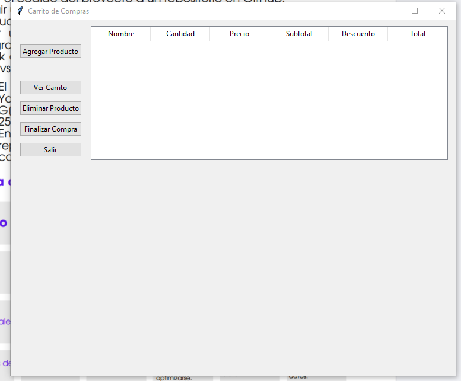

🛒 Senior Dev Challenge: Carrito de Compras

📌 Descripción
Este reto está diseñado para evaluar habilidades avanzadas en desarrollo de software, arquitectura de código y buenas prácticas. Se debe construir un carrito de compras que permita a los usuarios:

Agregar productos al carrito

Eliminar productos del carrito

Ver el total de la compra

Generar e imprimir una factura

Abrir el carrito y agregar o dismunuir las unidades

El enfoque debe ser modular, escalable y bien estructurado.

🎯 Requisitos Funcionales

Agregar productos al carrito

Cada producto tiene un nombre, precio y cantidad.

Eliminar productos del carrito

Se debe poder eliminar un producto específico del carrito.

Editar cantidades al Ver Carrito

Agregar o dismunuir unidades del producto al abrir el carrito

Calcular el total

Se debe mostrar el total de la compra considerando la cantidad de cada producto.

Generar e imprimir una factura

La factura debe incluir:
Lista de productos con su cantidad y precio
El total de la compra
Fecha de emisión

